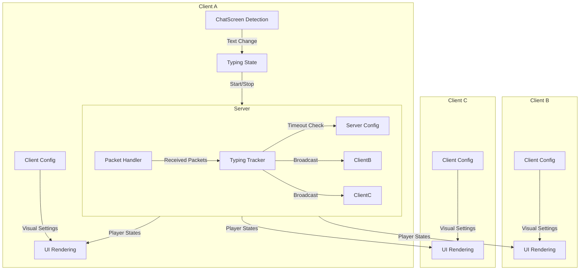
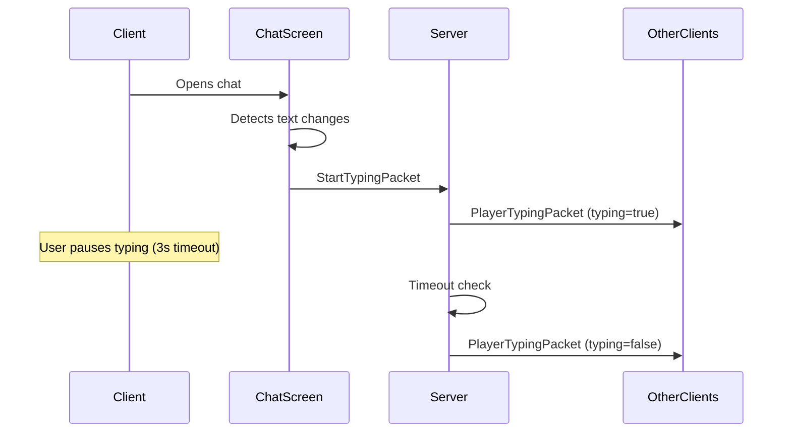

# IsTyping

[](https://www.minecraft.net/)
[](https://fabricmc.net/)
[](https://github.com/architectury/architectury-api)
[](https://www.oracle.com/java/)
[](LICENSE)
[](https://ko-fi.com/nozzdev)

A multiplayer typing indicator mod for Minecraft Fabric that displays real-time typing status for players composing chat messages.

## Overview

IsTyping is a client-server mod that provides real-time typing indicators in multiplayer Minecraft. When a player begins typing in chat, other players see a subtle notification showing who is currently composing a message. The mod features automatic language detection, customizable visuals, and optimized network communication.

## Key Features

- **Real-time typing detection** - Instant visual feedback when players start typing
- **Automatic language detection** - Supports 9 languages with auto-detection from Minecraft settings
- **Client-server architecture** - Synchronized state management across all connected players
- **Configurable on both sides** - Server controls behavior, clients control appearance
- **Command filtering** - Messages starting with `/` don't trigger indicators
- **Performance optimized** - Minimal network overhead using heartbeat system (2s intervals)
- **Anti-spam protection** - Server-side cooldown and timeout management
- **Smooth animations** - Fade in/out effects with customizable speed

## Requirements

### Client & Server (Both Required)
- **Minecraft** 1.20.1
- **Fabric Loader** 0.17.2+
- **Fabric API** 0.92.6+
- **Architectury API** 9.2.14+
- **Java** 17

**Note:** The mod must be installed on both client and server. Client-only or server-only installations will not work.

## Installation

1. Download the latest release from [Modrinth](https://modrinth.com/mod/istyping) or [GitHub Releases](https://github.com/valentin-marquez/is-Typing/releases)
2. Place the JAR file in the `mods` folder on both client and server
3. Ensure all dependencies are installed (Fabric API, Architectury API)
4. Launch Minecraft - configuration files will be generated automatically in the `config` folder

## Configuration

IsTyping uses separate configuration files for client and server to maintain proper separation of concerns.

### Server Configuration

Controls typing detection behavior and synchronization. Located at `config/istyping.properties` (server-side):

```properties
# IsTyping Server Configuration
typing_timeout_ms=4000              # Time (ms) until player is considered stopped typing
heartbeat_interval_ms=2000          # Expected client heartbeat interval
max_tracked_players=50              # Maximum players tracked simultaneously
cooldown_between_typing_ms=500     # Anti-spam cooldown between typing events
enable_typing_indicator=true        # Master switch to enable/disable mod
```

### Client Configuration

Controls visual presentation only. Located at `config/istyping-client.properties` (client-side):

```properties
# IsTyping Client Configuration
language=auto                       # UI language (auto detects from Minecraft)
overlay_y_offset=28                 # Distance from bottom of screen
max_displayed_players=3             # Max players shown in typing indicator
animation_speed_ms=500              # Speed of dot animation
text_color=FFAAAAAA                # Text color in ARGB hex format
background_color=80000000          # Background color in ARGB hex format
show_animation=true                 # Enable animated dots
fade_speed=0.1                      # Speed of fade in/out effect
```

## Configuration Reference

### Server Options

| Property | Range | Default | Description |
|----------|-------|---------|-------------|
| `typing_timeout_ms` | 1000-10000 | 4000 | Milliseconds until player stops typing |
| `heartbeat_interval_ms` | 1000-5000 | 2000 | Expected client heartbeat interval |
| `max_tracked_players` | 10-500 | 50 | Maximum players tracked simultaneously |
| `cooldown_between_typing_ms` | 100-2000 | 500 | Anti-spam cooldown between typing events |
| `enable_typing_indicator` | true/false | true | Master switch for the mod |

### Client Options

| Property | Type | Range | Default | Description |
|----------|------|-------|---------|-------------|
| `language` | String | auto, en, es, pt, fr, de, ru, ja, ko, zh | auto | UI language - 'auto' detects from Minecraft settings |
| `overlay_y_offset` | Integer | 10-100 | 28 | Distance in pixels from bottom of screen |
| `max_displayed_players` | Integer | 1-10 | 3 | Maximum number of players shown simultaneously |
| `animation_speed_ms` | Integer | 100-2000 | 500 | Speed of dot animation in milliseconds |
| `text_color` | Hex | ARGB | FFAAAAAA | Text color in ARGB format (Alpha, Red, Green, Blue) |
| `background_color` | Hex | ARGB | 80000000 | Background color in ARGB format |
| `show_animation` | Boolean | true/false | true | Enable/disable animated typing dots |
| `fade_speed` | Float | 0.01-1.0 | 0.1 | Speed of fade in/out animations (higher = faster) |

### Why Separate Configurations?

The mod uses a **client-server architecture** that requires different configuration scopes:

**Server Configuration:**
- Controls the **behavior** and **timing** of typing detection
- Validates typing events to prevent abuse
- Manages state synchronization across all connected clients
- Enforces rate limiting and timeout rules
- Ensures consistent behavior for all players

**Client Configuration:**
- Controls only **visual presentation** on your screen
- Does not affect other players' experience
- Allows personal customization without server permission
- Cannot be used to bypass server-side limitations

This separation ensures that gameplay-affecting behavior (timing, anti-spam) is controlled by the server, while visual preferences remain client-side.

## Architecture



## Technical Details

### Network Communication

The mod uses a client-server architecture with three packet types:

- **StartTypingPacket** (Client → Server): Initiated when player begins typing
- **StopTypingPacket** (Client → Server): Sent when player stops typing or closes chat
- **PlayerTypingPacket** (Server → Clients): Broadcasts current typing states to all players

### Typing Detection



### Language Detection

The client automatically detects the Minecraft language setting and maps it to supported translations:

1. Reads Minecraft language code (e.g., "es_es", "en_us")
2. Extracts language prefix ("es", "en")
3. Falls back to English if language not supported
4. Can be overridden manually in client configuration

### Performance Optimizations

- Heartbeat system reduces network traffic (2-second intervals)
- Server-side timeout management prevents memory leaks
- Client-side command filtering (messages starting with "/" are ignored)
- Efficient state tracking using UUID-based maps
- Minimal UI overhead with fade animations

## Supported Languages

| Language | Code | Example |
|----------|------|---------|
| English | en | "Player1 is typing..." |
| Spanish | es | "Player1 está escribiendo..." |
| Portuguese | pt | "Player1 está digitando..." |
| French | fr | "Player1 est en train d'écrire..." |
| German | de | "Player1 schreibt..." |
| Russian | ru | "Player1 печатает..." |
| Japanese | ja | "Player1が入力しています..." |
| Korean | ko | "Player1님이 입력 중..." |
| Chinese | zh | "Player1正在输入..." |

## Building from Source

```bash
# Clone the repository
git clone https://github.com/valentin-marquez/is-Typing.git
cd is-Typing

# Build using Gradle
./gradlew build

# Output location
# fabric/build/libs/istyping-fabric-<version>.jar
```

### Development Setup

```bash
# Generate IDE files
./gradlew genSources

# Run test server
./gradlew :fabric:runServer

# Run test client
./gradlew :fabric:runClient
```

## Project Structure

```
is-Typing/
├── common/          # Shared code between platforms
│   └── src/main/java/com/nozz/it/
├── fabric/          # Fabric-specific implementation
│   └── src/main/
│       ├── java/com/nozz/it/fabric/
│       └── resources/
│           ├── fabric.mod.json
│           └── assets/istyping/icon.png
└── docs/            # Documentation files
    └── MODRINTH.md  # Modrinth page content
```

## Contributing

Contributions are welcome! Please feel free to submit a Pull Request.

## License

This project is licensed under the MIT License - see the [LICENSE](LICENSE) file for details.

## Support

If you enjoy this mod and want to support its development:

[](https://ko-fi.com/nozzdev)

## Links

- [Modrinth](https://modrinth.com/mod/istyping)
- [GitHub Repository](https://github.com/valentin-marquez/is-Typing)
- [Issue Tracker](https://github.com/valentin-marquez/is-Typing/issues)
- `common/build/libs/` (Common library)

## License

This project is licensed under the MIT License - see the [LICENSE](LICENSE) file for details.

## Inspiration

Originally inspired by typing indicators commonly found in modern chat applications.