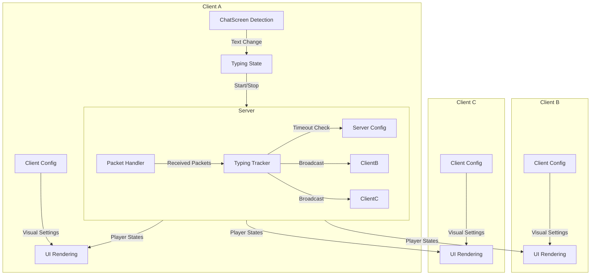
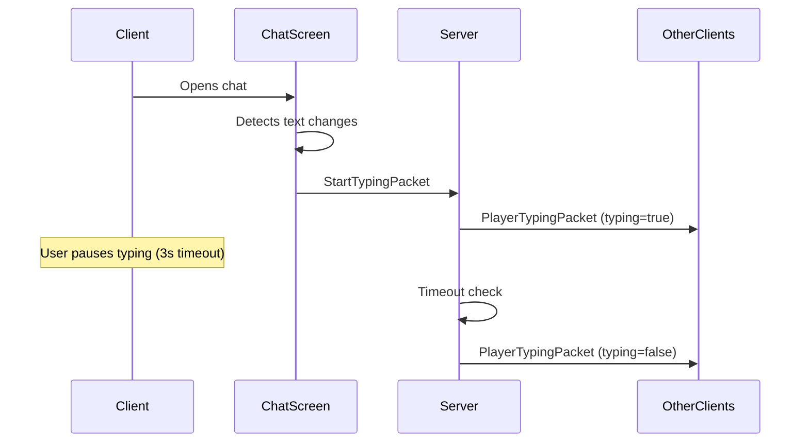

# IsTyping

[](https://www.minecraft.net/)
[](https://fabricmc.net/)
[](https://github.com/architectury/architectury-api)
[](https://www.oracle.com/java/)
[](LICENSE)

A typing indicator for chat with automatic language detection and configurable presentation.

## Features

- Real-time typing indicators for all players
- Automatic language detection based on Minecraft client settings
- Separate client and server configuration files
- Smooth fade animations and customizable positioning
- Command filtering (ignores messages starting with /)
- Low network overhead with optimized packet handling
- Multi-language support (English, Spanish, Portuguese, French, German, Russian, Japanese, Korean, Chinese)

## Requirements

### Client & Server
- Minecraft 1.20.1
- Fabric Loader 0.14.0+
- Fabric API
- Architectury API 9.2.14

## Installation

1. Download the mod JAR file
2. Place in the `mods` folder on both client and server
3. Launch Minecraft
4. Configuration files will be created automatically

## Configuration

### Server Configuration

Edit `config/istyping.properties` (server-side):

```properties
# IsTyping Server Configuration
typing_timeout_ms=4000
heartbeat_interval_ms=2000
max_tracked_players=50
cooldown_between_typing_ms=500
enable_typing_indicator=true
```

### Client Configuration

Edit `config/istyping-client.properties` (client-side):

```properties
# IsTyping Client Configuration
language=auto
overlay_y_offset=28
max_displayed_players=3
animation_speed_ms=500
text_color=FFAAAAAA
background_color=80000000
show_animation=true
fade_speed=0.1
```

## Configuration Reference

### Server Options

| Property | Range | Default | Description |
|----------|-------|---------|-------------|
| `typing_timeout_ms` | 1000-10000 | 4000 | Milliseconds until player stops typing |
| `heartbeat_interval_ms` | 1000-5000 | 2000 | Expected client heartbeat interval |
| `max_tracked_players` | 10-500 | 50 | Maximum players tracked simultaneously |
| `cooldown_between_typing_ms` | 100-2000 | 500 | Anti-spam cooldown between typing events |
| `enable_typing_indicator` | true/false | true | Master switch for the mod |

### Client Options

| Property | Range | Default | Description |
|----------|-------|---------|-------------|
| `language` | auto/en/es/pt/fr/de/ru/ja/ko/zh | auto | UI language (auto-detects from Minecraft) |
| `overlay_y_offset` | 10-100 | 28 | Distance from bottom of screen |
| `max_displayed_players` | 1-10 | 3 | Maximum players shown in indicator |
| `animation_speed_ms` | 100-2000 | 500 | Speed of dot animation |
| `text_color` | ARGB hex | FFAAAAAA | Text color in ARGB format |
| `background_color` | ARGB hex | 80000000 | Background color in ARGB format |
| `show_animation` | true/false | true | Enable animated dots |
| `fade_speed` | 0.01-1.0 | 0.1 | Speed of fade in/out effect |

## Architecture



## Technical Details

### Network Communication

The mod uses a client-server architecture with three packet types:

- **StartTypingPacket** (Client → Server): Initiated when player begins typing
- **StopTypingPacket** (Client → Server): Sent when player stops typing or closes chat
- **PlayerTypingPacket** (Server → Clients): Broadcasts current typing states to all players

### Typing Detection



### Language Detection

The client automatically detects the Minecraft language setting and maps it to supported translations:

1. Reads Minecraft language code (e.g., "es_es", "en_us")
2. Extracts language prefix ("es", "en")
3. Falls back to English if language not supported
4. Can be overridden manually in client configuration

### Performance Optimizations

- Heartbeat system reduces network traffic (2-second intervals)
- Server-side timeout management prevents memory leaks
- Client-side command filtering (messages starting with "/" are ignored)
- Efficient state tracking using UUID-based maps
- Minimal UI overhead with fade animations

## Supported Languages

| Language | Code | Example |
|----------|------|---------|
| English | en | "Player1 is typing..." |
| Spanish | es | "Player1 está escribiendo..." |
| Portuguese | pt | "Player1 está digitando..." |
| French | fr | "Player1 est en train d'écrire..." |
| German | de | "Player1 schreibt..." |
| Russian | ru | "Player1 печатает..." |
| Japanese | ja | "Player1が入力しています..." |
| Korean | ko | "Player1님이 입력 중..." |
| Chinese | zh | "Player1正在输入..." |

## Building

```bash
./gradlew build
```

Built JARs will be available in:
- `fabric/build/libs/` (Fabric mod)
- `common/build/libs/` (Common library)

## License

This project is licensed under the MIT License - see the [LICENSE](LICENSE) file for details.

## Inspiration

Originally inspired by typing indicators commonly found in modern chat applications.